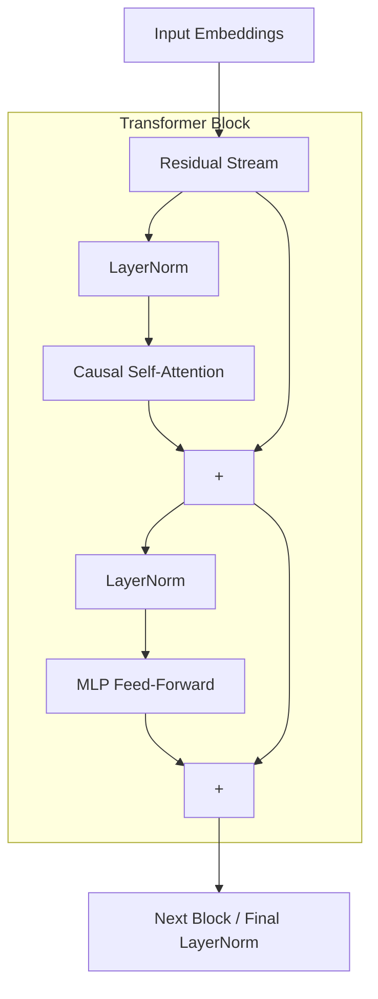

# 🧠 Architecture & Hardware Optimizations

NanoTransformer Core implements a **Decoder-Only Transformer**, specifically modeling the architecture of OpenAI's
GPT-2 (124M parameters). However, the implementation is modernized using 2024-era hardware optimization techniques to
maximize GPU utilization.

---

## 1. The Transformer Block (GPT-2 Style)

Unlike the original "Attention Is All You Need" paper, GPT-2 uses a **Pre-LayerNorm** architecture. This means
normalization is applied *before* the Attention and Feed-Forward mechanisms, creating a cleaner residual gradient path.



### Residual Scaling (The $1/\sqrt{2L}$ Rule)

In deep neural networks, variance accumulates along the residual stream. If unchecked, this causes activations to
explode in deeper layers.
During initialization (`model.py -> _init_weights`), we apply a special `NANOGPT_SCALE_INIT` flag to the final
projection layers (`c_proj`). This scales down the initial weights by $1/\sqrt{2L}$ (where $L$ is the number of layers),
ensuring perfectly stable training from Step 0.

---

## 2. Hardware-Level Optimizations

### FlashAttention ⚡

Standard self-attention computes an $N \times N$ matrix (where $N$ is the context length). For a 1024-token context
window, this requires materializing a massive tensor in the GPU's High-Bandwidth Memory (HBM), which is extremely slow.
We utilize PyTorch's `F.scaled_dot_product_attention`, which automatically invokes **FlashAttention**. FlashAttention
computes the softmax in "tiles" in the SRAM (GPU cache) rather than HBM, resulting in a dramatic memory reduction and
speedup.

### Mixed Precision (`bfloat16` & TF32)

Matrix multiplications (GEMMs) are handled by specialized hardware on modern NVIDIA GPUs (Tensor Cores).

- **TF32:** We set `torch.set_float32_matmul_precision('high')`, which internally reduces the mantissa of 32-bit floats
  to 10 bits. This allows Tensor Cores to process them massively faster while retaining the numerical range of
  `float32`.
- **`bfloat16` Autocast:** In `train.py`, the forward pass is wrapped in `torch.autocast`. Heavy matrix multiplications
  are instantly downcasted to 16-bit precision, while unstable operations (like Softmax and Cross-Entropy Loss) remain
  in FP32 to prevent numeric overflow.

### Architectural Weight Tying

The model has two massive matrices:

1. `wte` (Token Embeddings): Maps 50,304 tokens to 768 dimensions.
2. `lm_head` (Output Prediction): Maps 768 dimensions back to 50,304 tokens.

Because both layers deal with the exact same semantic relationships (Token $\leftrightarrow$ Feature), we point both
layers to the exact same physical memory block in PyTorch:

```python
self.transformer.wte.weight = self.lm_head.weight
```

This reduces the total parameter count by ~30% (saving nearly 40 million parameters) and acts as a powerful form of
regularization.

---

## 3. Custom Optimizer Logic (AdamW)

Standard PyTorch optimizers apply Weight Decay (L2 Regularization) to every single parameter in the model. This is
mathematically suboptimal. Weight decay should shrink multi-dimensional weights (matrices) to prevent overfitting, but
it should **never** shrink 1D vectors like Biases and LayerNorm scaling factors, which simply shift distributions.

Our `configure_optimizers` function explicitly splits the parameters into `decay_params` (≥ 2D) and `nodecay_params` (<
2D) before passing them to AdamW.

---
